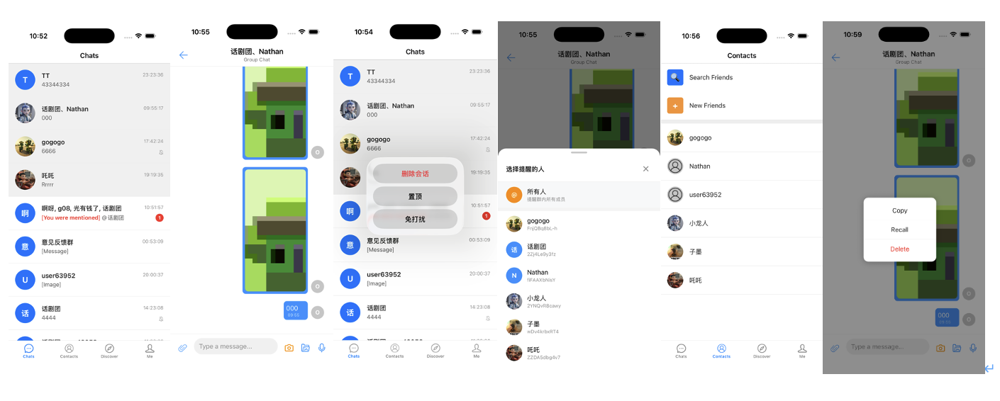

,
# Juggle IM React Native SDK

React Native wrapper for Juggle IM SDK，提供即时通讯功能的React Native封装。
## 功能介绍


## 安装

```bash
npm install juggleim-rnsdk --legacy-peer-deps
```

```
rn项目中需要在android目录的 gradle 中配置原生依赖：        maven { url "https://repo.juggle.im/repository/maven-releases/" }
```

## 初始化

在使用Juggle IM SDK之前，需要先进行初始化设置：

```javascript
import JuggleIM from 'juggleim-rnsdk';

// 设置服务器地址
JuggleIM.setServerUrls(['your_server_url']);

// 初始化SDK
JuggleIM.init('your_app_key');

// 连接服务器
JuggleIM.connect('your_token');
```

## 监听器

### 连接状态监听

```javascript
/**
 * 连接状态监听器回调函数
 * @param {ConnectionStatus} status - 连接状态
 * @param {number} code - 状态码
 *        0: CONNECT_SUCCESS 链接成功
 *        11000: CONNECT_ERROR 默认错误
 *        11001: CONNECT_APPKEY_IS_REQUIRE 未传 Appkey
 *        11002: CONNECT_TOKEN_NOT_EXISTS 未传 Token
 *        11003: CONNECT_APPKEY_NOT_EXISTS Appkey 不存在
 *        11004: CONNECT_TOKEN_ILLEGAL Token 不合法
 *        11005: CONNECT_TOKEN_UNAUTHORIZED Token 未授权
 *        11006: CONNECT_TOKEN_EXPIRE Token 已过期
 *        11008: CONNECT_UNSUPPORT_PLATFORM 不支持的平台类型
 *        11009: CONNECT_APP_BLOCKED App已封禁
 *        11010: CONNECT_USER_BLOCKED 用户已封禁
 *        11011: CONNECT_USER_KICKED 被踢下线
 *        11012: CONNECT_USER_LOGOUT 注销下线
 * @param {string} extra - 扩展信息
 */
const unsubscribe = JuggleIM.addConnectionStatusListener('listener_key', (status, code, extra) => {
  console.log('Connection status:', status);
});

// 取消监听
// unsubscribe();
```

### 消息监听

```javascript
const unsubscribe = JuggleIM.addMessageListener('listener_key', {
  onMessageReceive: (message) => {
    console.log('Received message:', message);
  },
  onMessageRecall: (message) => {
    console.log('Message recalled:', message);
  },
  onMessageUpdate: (message) => {
    console.log('Message updated:', message);
  },
  onMessageDelete: (conversation, clientMsgNos) => {
    console.log('Messages deleted:', conversation, clientMsgNos);
  },
  onMessageClear: (conversation, timestamp, senderId) => {
    console.log('Messages cleared:', conversation, timestamp, senderId);
  },
  onMessageReactionAdd: (conversation, reaction) => {
    console.log('Message reaction added:', conversation, reaction);
  },
  onMessageReactionRemove: (conversation, reaction) => {
    console.log('Message reaction removed:', conversation, reaction);
  },
  onMessageSetTop: (message, operator, isTop) => {
    console.log('Message set top:', message, operator, isTop);
  }
});

// 取消监听
// unsubscribe();
```

### 消息阅读状态监听

```javascript
const unsubscribe = JuggleIM.addMessageReadReceiptListener('read_listener_key', {
  onMessagesRead: (conversation, messageIds) => {
    console.log('Messages read:', conversation, messageIds);
  },
  onGroupMessagesRead: (conversation, messages) => {
    console.log('Group messages read info updated:', conversation, messages);
  }
});

// 取消监听
// unsubscribe();
```

### 消息销毁监听

```javascript
const unsubscribe = JuggleIM.addMessageDestroyListener('destroy_listener_key', {
  onMessageDestroyTimeUpdate: (messageId, conversation, destroyTime) => {
    console.log('Message destroy time updated:', messageId, conversation, destroyTime);
  }
});

// 取消监听
// unsubscribe();
```

### 会话监听

```javascript
const unsubscribe = JuggleIM.addConversationListener('listener_key', {
  onConversationInfoAdd: (conversations) => {
    console.log('New conversations:', conversations);
  },
  onConversationInfoUpdate: (conversations) => {
    console.log('Updated conversations:', conversations);
  },
  onConversationInfoDelete: (conversations) => {
    console.log('Deleted conversations:', conversations);
  },
  onTotalUnreadMessageCountUpdate: (count) => {
    console.log('Total unread count updated:', count);
  }
});

// 取消监听
// unsubscribe();
```

## 会话操作

### 获取会话列表

```javascript
/**
 * 会话信息列表
 * @property {Conversation} conversation - 会话
 * @property {number} unreadCount - 未读消息数
 * @property {boolean} isTop - 是否置顶
 * @property {boolean} isMute - 是否静音
 * @property {Message} [lastMessage] - 最后一条消息
 * @property {number} topTime - 置顶时间
 * @property {number} sortTime - 排序时间
 * @property {boolean} hasUnread - 是否有未读消息
 * @property {string} draft - 草稿
 * @property {ConversationMentionInfo} [mentionInfo] - 会话提及信息
 * @property {string} [name] - 会话名称
 * @property {string} [avatar] - 会话头像
 * @property {object} [extra] - 会话"头像/名称"扩展信息
 */
const conversations = await JuggleIM.getConversationInfoList({
  count: 20,
  timestamp: Date.now(),
  direction: 1 // 0-更新的消息, 1-更早的消息
});
```

### 获取单个会话

```javascript
/**
 * 会话信息
 * 注意：会话信息中包含会话的头像和名称，可以直接显示使用
 * 
 * @property {Conversation} conversation - 会话
 * @property {number} unreadCount - 未读消息数
 * @property {boolean} isTop - 是否置顶
 * @property {boolean} isMute - 是否静音
 * @property {Message} [lastMessage] - 最后一条消息
 * @property {number} topTime - 置顶时间
 * @property {number} sortTime - 排序时间
 * @property {boolean} hasUnread - 是否有未读消息
 * @property {string} draft - 草稿
 * @property {ConversationMentionInfo} [mentionInfo] - 会话提及信息
 * @property {string} [name] - 会话名称
 * @property {string} [avatar] - 会话头像
 * @property {object} [extra] - 会话"头像/名称"扩展信息
 */
const conversationInfo = await JuggleIM.getConversationInfo({
  conversationType: 1, // ConversationType.PRIVATE
  conversationId: 'user123'
});
```

### 创建会话

```javascript
const conversationInfo = await JuggleIM.createConversationInfo({
  conversationType: 1,
  conversationId: 'user123'
});
```

### 删除会话

```javascript
const result = await JuggleIM.deleteConversationInfo({
  conversationType: 1,
  conversationId: 'user123'
}, {
  onSuccess: () => {
    console.log('Conversation deleted successfully');
  },
  onError: (errorCode) => {
    console.log('Failed to delete conversation, error code:', errorCode);
  }
});
```

### 会话免打扰设置

```javascript
const result = await JuggleIM.setMute({
  conversationType: 1,
  conversationId: 'user123'
}, true); // true为开启免打扰
```

### 会话置顶设置

```javascript
const result = await JuggleIM.setTop({
  conversationType: 1,
  conversationId: 'user123'
}, true); // true为置顶会话
```

### 设置会话未读状态

```javascript
const result = await JuggleIM.setUnread({
  conversationType: 1,
  conversationId: 'user123'
}, true); // true为标记为未读
```

### 未读数操作

```javascript
// 清除会话未读数
const result = await JuggleIM.clearUnreadCount({
  conversationType: 1,
  conversationId: 'user123'
});

// 清除总未读数
const totalResult = await JuggleIM.clearTotalUnreadCount();

// 获取总未读数
const totalCount = await JuggleIM.getTotalUnreadCount();

// 获取指定类型的未读数
const typeUnreadCount = await JuggleIM.getUnreadCountWithTypes([1, 2]); // PRIVATE 和 GROUP 会话的未读数
```

### 草稿操作

```javascript
// 设置会话草稿
const setResult = await JuggleIM.setDraft({
  conversationType: 1,
  conversationId: 'user123'
}, 'Hello, this is a draft');

// 清除会话草稿
const clearResult = await JuggleIM.clearDraft({
  conversationType: 1,
  conversationId: 'user123'
});
```

### 会话标签操作

```javascript
// 将会话添加到标签
const addResult = await JuggleIM.addConversationsToTag({
  tagId: 'tag123',
  conversations: [
    {
      conversationType: 1,
      conversationId: 'user123'
    },
    {
      conversationType: 2,
      conversationId: 'group456'
    }
  ]
});

// 从标签中移除会话
const removeResult = await JuggleIM.removeConversationsFromTag({
  tagId: 'tag123',
  conversations: [
    {
      conversationType: 1,
      conversationId: 'user123'
    }
  ]
});
```

### 获取置顶会话列表

```javascript
/**
 * 置顶会话列表
 * @property {ConversationInfo[]} conversations - 会话列表
 */
const topConversations = await JuggleIM.getTopConversationInfoList(
  20,         // 获取数量
  Date.now(), // 时间戳
  1           // 拉取方向: 0-更新的消息, 1-更早的消息
);
```

## 消息操作

### 发送消息

```javascript
const message = await JuggleIM.sendMessage({
  conversationType: 1,
  conversationId: 'user123',
  content: {
    contentType: 'text',
    content: 'Hello World!'
  } as TextMessageContent
}, {
  onSuccess: (message) => {
    console.log('Message sent successfully:', message);
  },
  onError: (message, errorCode) => {
    console.log('Send failed with error:', errorCode);
  }
});
```

### 发送图片消息

```javascript
const imageMessage = await JuggleIM.sendImageMessage({
  conversationType: 1,
  conversationId: 'user123',
  content: {
    contentType: 'jg:img',
    localPath: '/path/to/image.jpg',
    width: 800,
    height: 600
  } as ImageMessageContent
}, {
  onProgress: (progress, message) => {
    console.log('Upload progress:', progress);
  },
  onSuccess: (message) => {
    console.log('Image sent successfully:', message);
  },
  onError: (message, errorCode) => {
    console.log('Send image failed with error:', errorCode);
  }
});
```

### 发送文件消息

```javascript
const fileMessage = await JuggleIM.sendFileMessage({
  conversationType: 1,
  conversationId: 'user123',
  content: {
    contentType: 'jg:file',
    localPath: '/path/to/document.pdf',
    name: 'document.pdf',
    size: 102400
  } as FileMessageContent
}, {
  onProgress: (progress, message) => {
    console.log('Upload progress:', progress);
  },
  onSuccess: (message) => {
    console.log('File sent successfully:', message);
  },
  onError: (message, errorCode) => {
    console.log('Send file failed with error:', errorCode);
  }
});
```

### 发送语音消息

```javascript
const voiceMessage = await JuggleIM.sendVoiceMessage(
  message: {
    conversationType: 1,
    conversationId: 'user123',
    content: {
      contentType: 'jg:voice',
      localPath: '/path/to/audio.mp3',
      duration: 10
    } as VoiceMessageContent
  },
  {
    onProgress: (progress, message) => {
      console.log('Upload progress:', progress);
    },
    onSuccess: (message) => {
      console.log('Voice sent successfully:', message);
    },
    onError: (message, errorCode) => {
      console.log('Send voice failed with error:', errorCode);
    }
  }
)
```

### 发送媒体消息

通用接口，用于发送包含媒体内容（如图片、文件、语音等）的消息。

```javascript
const message = await JuggleIM.sendMediaMessage({
  conversationType: 1,
  conversationId: 'user123',
  content: {
    contentType: 'jg:img', // 或 'jg:file', 'jg:voice', 'jg:video' 等
    localPath: '/path/to/media'
    // ... 其他具体类型的属性
  }
}, {
  onProgress: (progress, message) => {
    console.log('Upload progress:', progress);
  },
  onSuccess: (message) => {
    console.log('Media message sent successfully:', message);
  },
  onError: (message, errorCode) => {
    console.log('Send media failed with error:', errorCode);
  },
  onCancel: (message) => {
    console.log('Send cancelled:', message);
  }
});
```

### 重发消息

使用场景：当消息列表中某条消息发送失败（出现"红点"）时，可调用此接口进行重发。建议根据接口同步返回的 `message` 对象立即更新当前消息列表的排序（通常置于底部或保持原位，取决于UI需求），随后监听回调更新最终状态。

#### 重发普通消息

```javascript
const message = await JuggleIM.resendMessage(failedMessage, {
  onSuccess: (message) => {
    console.log('Message resent successfully:', message);
  },
  onError: (message, errorCode) => {
    console.log('Resend failed with error:', errorCode);
  }
});
```

#### 重发媒体消息

```javascript
const message = await JuggleIM.resendMediaMessage(failedMediaMessage, {
  onProgress: (progress, message) => {
    console.log('Resend upload progress:', progress);
  },
  onSuccess: (message) => {
    console.log('Media message resent successfully:', message);
  },
  onError: (message, errorCode) => {
    console.log('Resend media failed with error:', errorCode);
  },
  onCancel: (message) => {
    console.log('Resend cancelled:', message);
  }
});
```

### 获取历史消息

```javascript
/**
 * 消息对象
 * 注意：消息对象中包含发送者用户信息，可以直接显示使用
 * @interface Message
 * @property {number} clientMsgNo - 客户端消息序号
 * @property {string} localAttribute - 本地属性
 * @property {number} messageState - 消息状态 : 0未知, 1-发送中, 2-已发送, 3-发送失败, 4-上传中
 * @property {boolean} isEdited - 是否已编辑
 * @property {number} direction - 消息方向: 1-发送, 2-接收
 * @property {boolean} isDelete - 是否已删除
 * @property {string} senderUserId - 发送者用户ID
 * @property {string} senderUserName - 发送者用户昵称
 * @property {string} senderUserAvatar - 发送者用户头像
 * @property {object} senderUserExtra - 发送者用户扩展信息
 * @property {string} messageId - 消息ID
 * @property {boolean} hasRead - 是否已读
 * @property {number} timestamp - 消息时间戳
 * @property {Conversation} conversation - 会话对象
 * @property {MessageContent} content - 消息内容
 * @property {GroupMessageReadInfo} [groupMessageReadInfo] - 群消息阅读信息（可选）
 * @property {MessageMentionInfo} mentionInfo - 消息提及信息
 * @property {Message} [referredMessage] - 引用的消息
 */
/**
 * 消息响应对象
 * @interface MessageResponse
 * @property {Message[]} messages - 消息列表
 * @property {number} timestamp - 时间戳
 * @property {boolean} hasMore - 是否有更多消息
 */
const messageResponse = await JuggleIM.getMessageList({
  conversationType: 1,
  conversationId: 'user123'
}, 1, { // 方向: 1表示获取更早的消息(向前翻页), 0表示获取更新的消息(向后翻页)
  count: 20,
  startTime: Date.now()
});
```

### 撤回消息

```javascript
const result = await JuggleIM.recallMessage(['message_id_1', 'message_id_2'], {
  reason: 'sent by mistake'
});
```

### 消息反应

```javascript
// 添加消息反应
const addResult = await JuggleIM.addMessageReaction('message_id', 'thumbs_up');

// 移除消息反应
const removeResult = await JuggleIM.removeMessageReaction('message_id', 'thumbs_up');
```

## 音视频通话 (Call)

### 初始化 (Initialization)

> rn项目中需要在android目录的 gradle 中配置原生依赖： maven { url 'https://storage.zego.im/maven' }  

```javascript
import { JuggleIMCall } from 'juggleim-rnsdk';

// 初始化 Zego 引擎
JuggleIMCall.initZegoEngine(123456789);
```

### 发起通话 (Start Call)

```javascript
import { CallMediaType } from 'juggleim-rnsdk';

// 发起单人视频通话
const session = await JuggleIMCall.startSingleCall(
  'targetUserId',
  CallMediaType.VIDEO
);

// 发起多人语音通话
const session = await JuggleIMCall.startMultiCall(
  ['user1', 'user2'],
  CallMediaType.AUDIO
);
```

### 通话监听 (Call Listener)

```javascript
// 监听收到通话请求
const unsubscribe = JuggleIMCall.addReceiveListener({
  onCallReceive: (session) => {
    console.log('收到通话请求:', session);
    // 可以在此处跳转到通话页面
  }
});

// 取消监听
// unsubscribe();
```

### 获取通话会话 (Get Session)

```javascript
const session = await JuggleIMCall.getCallSession('call_id');
if (session) {
  // 获取成功
}
```

### UI 组件 (UI Component)

`ZegoSurfaceView` 用于渲染视频流。

```javascript
import { ZegoSurfaceView } from 'juggleim-rnsdk';
import { findNodeHandle } from 'react-native';

<ZegoSurfaceView
  style={{ width: 100, height: 150 }}
  ref={(ref) => {
    // 将视图与用户绑定
    const viewTag = findNodeHandle(ref);
    if (session && viewTag) {
      session.setVideoView(userId, viewTag);
    }
  }}
/>
```

### 通话控制 (Call Control)

`CallSession` 对象提供了多种控制方法：

```javascript
// 接听
session.accept();

// 挂断
session.hangup();

// 开启/关闭麦克风
session.muteMicrophone(true);

// 开启/关闭摄像头
session.enableCamera(false);

// 切换前后摄像头
session.useFrontCamera(true);

// 开启/关闭扬声器
session.setSpeakerEnable(true);
```

## 朋友圈 (Moment)

### 发布朋友圈

```javascript
import { JuggleIMMoment } from 'juggleim-rnsdk';

const moment = await JuggleIMMoment.addMoment('今天是个好日子', [
  {
    type: 'image',
    url: 'http://example.com/image.jpg',
    width: 100,
    height: 100
  }
]);
```

### 删除朋友圈

```javascript
await JuggleIMMoment.removeMoment('moment_id');
```

### 获取朋友圈列表

```javascript
const result = await JuggleIMMoment.getMomentList({
  count: 10,
  timestamp: Date.now(),
  direction: 1 // 1: old, 0: new
});
// result.list: Moment[]
// result.isFinished: boolean
```

### 获取缓存的朋友圈列表

```javascript
/**
 * 获取缓存的朋友圈列表（缓存的数据不一定是最新版本，可用于第一时间渲染界面，优化用户体验）
 * 根据返回的数据中 isFinished 判断是否获取完毕，上拉刷新继续获取
 * @param count 获取的朋友圈数量
 * @param timestamp 时间戳
 * @param direction 1: old, 0: new
 * @return 缓存的朋友圈列表
 */
const dataset = await JuggleIMMoment.getCachedMomentList({
  count: 10,
  timestamp: Date.now(),
  direction: 1
});
```

### 获取朋友圈详情

```javascript
const moment = await JuggleIMMoment.getMoment('moment_id');
```

### 发布评论

```javascript
const comment = await JuggleIMMoment.addComment('moment_id', 'parent_comment_id_or_empty', '评论内容');
```

### 删除评论

```javascript
await JuggleIMMoment.removeComment('moment_id', 'comment_id');
```

### 获取评论列表

```javascript
const result = await JuggleIMMoment.getCommentList({
  momentId: 'moment_id',
  count: 20,
  timestamp: Date.now(),
  direction: 1
});
```

### 添加点赞

```javascript
await JuggleIMMoment.addReaction('moment_id', 'thumbsup');
```

### 取消点赞

```javascript
await JuggleIMMoment.removeReaction('moment_id', 'thumbsup');
```

### 获取点赞列表

```javascript
const reactions = await JuggleIMMoment.getReactionList('moment_id');
```

## 类型定义

### 会话类型

```typescript
export enum ConversationType {
  PRIVATE = 1,
  GROUP = 2,
  CHATROOM = 3,
  SYSTEM = 4,
}
```

### 连接状态

```typescript
export type ConnectionStatus =
  | "connected"
  | "connecting"
  | "disconnected"
  | "failure"
  | "dbOpen"
  | "dbClose";
```

### 消息内容类型

支持多种消息内容类型：

#### 文本消息 (TextMessageContent)
```typescript
export interface TextMessageContent extends MessageContent {
  content: string;
}
```

#### 图片消息 (ImageMessageContent)
```typescript
export interface ImageMessageContent extends MessageContent {
  localPath: string;
  thumbnailLocalPath?: string;
  url?: string;
  thumbnailUrl?: string;
  width: number;
  height: number;
}
```

#### 文件消息 (FileMessageContent)
```typescript
export interface FileMessageContent extends MessageContent {
  localPath: string;
  url?: string;
  name: string;
  size: number;
  type?: string;
}
```

#### 语音消息 (VoiceMessageContent)
```typescript
export interface VoiceMessageContent extends MessageContent {
  localPath: string;
  url?: string;
  duration: number;
}
```

#### 消息对象 (Message)
```typescript
export interface Message {
  clientMsgNo: number;
  localAttribute: string;
  messageState: number;
  isEdite: boolean;
  direction: number;
  isDelete: boolean;
  senderUserId: string;
  messageId: string;
  hasRead: boolean;
  timestamp: number;
  conversation: Conversation;
  content: MessageContent;
  groupMessageReadInfo?: GroupMessageReadInfo;
  mentionInfo: MessageMentionInfo;
}
```

#### 会话对象 (Conversation)
```typescript
export interface Conversation {
  conversationType: number;
  conversationId: string;
}
```

#### 用户信息 (UserInfo)
```typescript
export interface UserInfo {
  userId: string;
  nickname: string;
  avatar: string;
}
```

#### 消息内容 (MessageContent)
```

```

#### 提及信息 (MessageMentionInfo)
```typescript
export interface MessageMentionInfo {
  /**
   *   DEFAULT(0),
   *   ALL(1),
   *   SOMEONE(2),
   *   ALL_AND_SOMEONE(3);
   */
  type: number;
  targetUsers: UserInfo[];
}
```

#### 发送自定义消息

* 自定义消息，继承自 CustomMessageContent 并设置消息类型
```typescript
export class TextCardMessage extends CustomMessageContent {
    title: string = '';
    description: string = '';
    url: string = '';

    constructor(title?: string, description?: string, url?: string) {
        super('demo:textcard');
        this.title = title || '';
        this.description = description || '';
        this.url = url || '';
    }
}
```
* 注册消息
```typescript
JuggleIM.registerCustomMessageType('demo:textcard', TextCardMessage);
```
* 发送消息
```typescript
JuggleIM.sendMessage({
    conversationType: 1,
    conversationId: 'user123',
    content: TextCardMessage,
});
```

* 上传图片
```typescript
/**
 * 上传图片
 * @param localPath  本地图片路径：Android - /path/to/image，iOS - url 
 * @returns Promise<string> 上传成功后返回图片url
 */
JuggleIM.uploadImage(localPath: string): Promise<string>;
```

### 朋友圈相关类型

#### 朋友圈内容 (Moment)
```typescript
export interface Moment {
  momentId: string;
  content: string;
  mediaList: MomentMedia[];
  userInfo: UserInfo;
  commentList: MomentComment[];
  reactionList: MomentReaction[];
  createTime: number;
}
```

#### 媒体资源 (MomentMedia)
```typescript
export type MomentMediaType = 'image' | 'video';

export interface MomentMedia {
  type: MomentMediaType;
  url: string;
  snapshotUrl?: string; // 视频或图片的缩略图
  height: number;
  width: number;
  duration?: number; // 仅视频有效
}
```

#### 评论 (MomentComment)
```typescript
export interface MomentComment {
  commentId: string;
  momentId: string;
  parentCommentId?: string;
  content: string;
  userInfo: UserInfo;
  parentUserInfo?: UserInfo;
  createTime: number;
}
```

#### 互动/点赞 (MomentReaction)
```typescript
export interface MomentReaction {
  key: string;
  userList: UserInfo[];
}
```

#### 获取列表选项 (GetMomentOption)
```typescript
export interface GetMomentOption {
  count: number;
  timestamp: number;
  direction: number;
}
```

#### 获取评论列表选项 (GetMomentCommentOption)
```typescript
export interface GetMomentCommentOption {
  momentId: string;
  count: number;
  timestamp: number;
  direction: number;
}
```

### 用户/群组信息相关
* 【服务端】应用服务注册用户到IM服务时，用户信息会记录到IM服务并同步到客户端SDK
* 【客户端】当客户端显示会话列表时，会话的用户/群组信息可以通过客户端SDK返回（会话的最后一条消息中也有发送者的用户信息）
* 【客户端】当客户端显示消息列表时，消息的用户信息可以通过客户端SDK返回
* 【服务端】为了保证应用服务中的用户信息与IM服务中的用户信息一致，当用户更新了用户信息时，你的应用服务需要将更新后的用户信息同步到IM服务
* 【客户端】为了保证客户端上始终使用最新的用户信息，你需要在进入“个人信息”页面的时候，调用SDK接口 同步最新的用户信息到客户端SDK中

#### 获取用户信息
```typescript
JuggleIM.getUserInfo(userId: string): Promise<UserInfo>;
```

#### 获取群组信息
```typescript
JuggleIM.getGroupInfo(groupId: string): Promise<GroupInfo>;
```

#### 获取群组成员
```typescript
JuggleIM.getGroupMemberList(groupId: string): Promise<UserInfo[]>;
```

#### 同步用户信息
```typescript
/**
 * 进入个人信息页面时，调用此接口同步最新的用户信息到客户端SDK中
 */
JuggleIM.fetchUserInfo(userInfo: UserInfo): Promise<void>;
```

#### 同步群组信息
```typescript
/**
 * 进入群组信息页面时，调用此接口同步最新的群组信息到客户端SDK中
 */
JuggleIM.fetchGroupInfo(groupId: string): Promise<void>;
```
