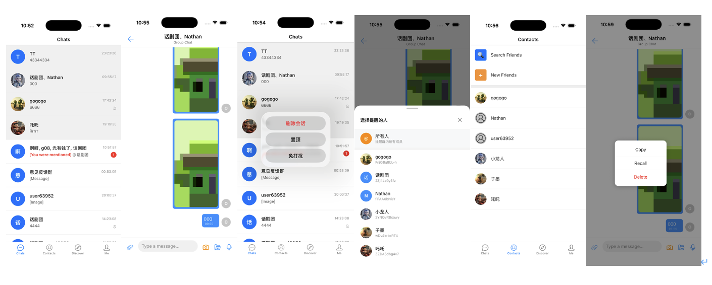

# JuggleIM React Native SDK

[简体中文](README.zh-CN.md) | English

[](https://www.npmjs.com/package/juggleim-rnsdk)
[](https://www.npmjs.com/package/juggleim-rnsdk)
[](https://github.com/juggleim/imsdk-rn/stargazers)
[](LICENSE)
[](https://reactnative.dev/)

**JuggleIM React Native SDK** is an Apache-2.0-licensed React Native bridge for building real-time chat and instant messaging apps on **iOS and Android**. It provides TypeScript definitions and native messaging capabilities for private chat, group chat, chat rooms, media messages, read receipts, message reactions, conversation management, voice/video calls, social moments, and AI streaming messages.



## Why JuggleIM?

- **One SDK for iOS and Android** — expose native JuggleIM capabilities through a consistent React Native API.
- **Production messaging primitives** — send, receive, recall, delete, search, merge, react to, and mark messages as read.
- **Rich message support** — text, image, file, voice, video, custom, merged, and streaming text messages.
- **Conversation management** — history, unread counts, drafts, pinned chats, mute settings, mentions, and tags.
- **Beyond basic chat** — one-to-one and group voice/video calls, user/group profiles, and social moments.
- **Developer friendly** — TypeScript declarations, listener-based events, an example app, and detailed API examples.

## Feature overview

| Capability | Included |
| --- | --- |
| Messaging | Private chat, group chat, chat rooms, system conversations, history, search |
| Message types | Text, image, file, voice, video, custom, merged, AI streaming text |
| Message state | Read receipts, recall, deletion, reactions, top messages, self-destruct events |
| Conversations | Unread counts, drafts, mute, pin, tags, mentions, pagination |
| Voice and video | One-to-one and multi-party calls powered by ZEGOCLOUD |
| Social | Moments, comments, reactions, cached timeline |
| Profiles | User, group, and group-member information |
| Platform | React Native 0.60+, Android 21+, iOS 9+, TypeScript definitions |

## Installation

Install the package from npm:

```bash
npm install juggleim-rnsdk --legacy-peer-deps
```

For Android, add the JuggleIM Maven repository to your project's repository configuration:

```groovy
allprojects {
    repositories {
        maven { url "https://repo.juggle.im/repository/maven-releases/" }
    }
}
```

If you use the voice/video call module on Android, also add:

```groovy
maven { url "https://storage.zego.im/maven" }
```

For iOS, install native dependencies after adding the package:

```bash
cd ios
pod install
```

## Quick start

Initialize the SDK, register a connection listener, and connect with a user token:

```javascript
import JuggleIM from 'juggleim-rnsdk';

const unsubscribe = JuggleIM.addConnectionStatusListener(
  'app_connection',
  (status, code, extra) => {
    console.log('JuggleIM connection:', status, code, extra);
  }
);

JuggleIM.setServerUrls(['your_server_url']);
JuggleIM.init('your_app_key');
JuggleIM.connect('your_user_token');

// Call unsubscribe() when the listener is no longer needed.
```

Send a text message:

```javascript
import { TextMessageContent } from 'juggleim-rnsdk';

JuggleIM.sendMessage(
  {
    conversationType: 1,
    conversationId: 'recipient_user_id',
    content: new TextMessageContent('Hello from React Native!')
  },
  {
    onSuccess: message => console.log('Sent:', message),
    onError: (message, errorCode) => console.error('Send failed:', errorCode)
  }
);
```

For authentication credentials and server endpoints, use the values issued by your JuggleIM deployment.

## Documentation

- [Complete API guide with examples (Simplified Chinese)](docs/API.zh-CN.md)
- [Simplified Chinese README](README.zh-CN.md)
- [React Native demo app](DEMO/)
- [TypeScript API declarations](juggleim-rnsdk/src/index.d.ts)
- [Issues and support](https://github.com/juggleim/imsdk-rn/issues)

The original detailed README content is preserved in the [complete API guide](docs/API.zh-CN.md), including listeners, conversations, messages, calls, moments, custom messages, and type definitions.

## Repository structure

```text
.
├── juggleim-rnsdk/   # React Native package, native bridges, and TypeScript types
├── DEMO/             # Example iOS and Android application
├── docs/             # Detailed documentation
├── README.md         # English overview
└── README.zh-CN.md   # 简体中文说明
```

## Use cases

JuggleIM can serve as the messaging layer for social apps, community products, customer support, marketplace chat, team collaboration, in-app messaging, AI assistants with streaming responses, and apps that need embedded voice or video calls.

## Contributing

Issues and pull requests are welcome.

1. Fork the repository and create a focused branch.
2. Keep changes minimal and consistent with the existing React Native, Android, and iOS patterns.
3. Add Chinese API documentation to public interfaces and add `TIPS` comments around complex or critical logic.
4. Verify the smallest relevant build or test before opening a pull request.

When reporting a bug, include the React Native version, platform and OS version, reproduction steps, logs, and a minimal example when possible.

## Support

- Bug reports and feature requests: [GitHub Issues](https://github.com/juggleim/imsdk-rn/issues)
- Email: [support@juggleim.com](mailto:support@juggleim.com)

If this React Native chat SDK helps your project, consider starring the repository. Stars help other developers discover and evaluate the project.

## License

Licensed under the [Apache License 2.0](LICENSE).
